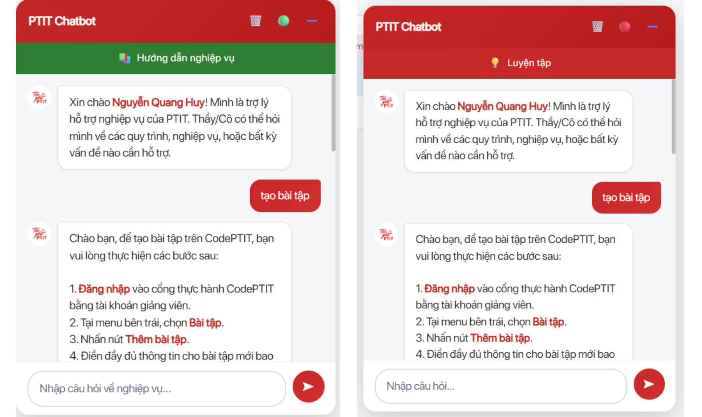

# PTIT Chatbot Assistant

<p align="center">
  
</p>

<p align="center">
  <strong>Chrome Extension - Trợ lý AI hỗ trợ sinh viên PTIT</strong>
</p>

<p align="center">
  
  
  
  
</p>

---

## Tổng quan

Extension trợ lý AI giúp sinh viên PTIT giải đáp thắc mắc, hỗ trợ học tập trên nền tảng **code.ptit.edu.vn**. Sử dụng **Google Gemini AI** để cung cấp câu trả lời thông minh và context-aware.

## Tính năng chính

| Tính năng | Mô tả |
|-----------|-------|
| **Context-aware** | Tự động đọc đề bài khi ở trang question |
| **2 chế độ** | Popup và Content Script widget |
| **Token Management** | Quản lý session token thông minh |
| **Lịch sử chat** | Lưu conversation history |
| **Bảo mật** | Chặn giải bài trong giờ kiểm tra |

## Tech Stack

- **Frontend:** Chrome Extension (Manifest V3), Vanilla JavaScript
- **Backend:** Node.js, Express.js
- **AI:** Google Gemini AI (`@google/generative-ai`)
- **Other:** UUID, dotenv

## Cấu trúc dự án

```
ptit-chatbot-assistant/
├── src/
│   ├── extension/              # Chrome Extension
│   │   ├── background/         # Service worker
│   │   ├── content/            # Content scripts
│   │   ├── popup/              # Popup UI
│   │   ├── assets/             # Icons, images
│   │   └── manifest.json
│   └── server/                 # Backend API
│       └── index.js
├── tests/                      # Test files
│   ├── extension/
│   └── server/
├── configs/                    # Configuration
│   └── .env.example
├── docs/                       # Documentation
│   ├── API.md
│   ├── ARCHITECTURE.md
│   ├── SETUP.md
│   └── images/
├── scripts/                    # Build scripts
├── .eslintrc.json
├── .gitignore
├── LICENSE
├── package.json
└── README.md
```

## Quick Start

### 1. Clone & Install

```bash
git clone https://github.com/a-hygge/CodePtit-Chatbot-Assistant.git
cd ptit-chatbot-assistant
npm install
```

### 2. Configure Environment

```bash
cp configs/.env.example .env
# Edit .env với API key của bạn
```

### 3. Start Server

```bash
npm start
```

### 4. Load Extension

1. Mở `chrome://extensions/`
2. Bật **Developer mode**
3. Click **"Load unpacked"**
4. Chọn thư mục `src/extension`

> Chi tiết: [docs/SETUP.md](docs/SETUP.md)

## Scripts

| Command | Description |
|---------|-------------|
| `npm start` | Khởi động production server |
| `npm run dev` | Khởi động dev server (auto-reload) |
| `npm test` | Chạy tests |
| `npm run lint` | Kiểm tra code style |
| `npm run lint:fix` | Tự động fix lint errors |

## API Documentation

Xem chi tiết tại [docs/API.md](docs/API.md)

| Method | Endpoint | Description |
|--------|----------|-------------|
| GET | `/health` | Health check |
| POST | `/check-user` | Kiểm tra user |
| POST | `/test-api-key` | Validate API key |
| POST | `/save-api-key` | Lưu API key |
| POST | `/get-token` | Lấy session token |
| POST | `/release-token` | Giải phóng token |
| POST | `/api/ask` | Gửi câu hỏi AI |

## Architecture

Xem chi tiết tại [docs/ARCHITECTURE.md](docs/ARCHITECTURE.md)

```
Chrome Extension  ──HTTP──►  Backend Server  ──API──►  Google Gemini AI
```

## Contributing

1. Fork the repository
2. Create feature branch (`git checkout -b feature/amazing-feature`)
3. Commit changes (`git commit -m 'Add amazing feature'`)
4. Push to branch (`git push origin feature/amazing-feature`)
5. Open a Pull Request
